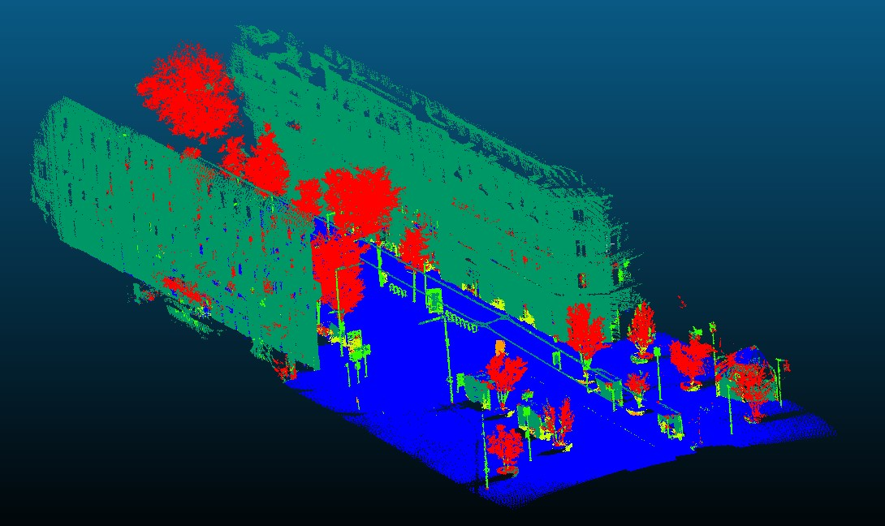

# PointClassification_Streets

This repository implements a classification procedure for the classification of streets point clouds.
The classification is done between 6 classes :
 - Ground
 - Building
 - Poles
 - Pedestrians
 - Cars
 - Vegetation

The main steps of the model are the following : 
 - Extraction of 18 features as done in [Semantic point cloud interpretation based on optimal neighborhoods, relevant features and efficient classifiers](https://www.researchgate.net/publication/272891952_Semantic_point_cloud_interpretation_based_on_optimal_neighborhoods_relevant_features_and_efficient_classifiers)
 - Computation of these features at 9 scales by iteratively downsampling the point cloud by a factor 2 as done in [Fast Semantic Segmentation of 3D point clouds with strongly varying density](https://www.researchgate.net/publication/303801297_FAST_SEMANTIC_SEGMENTATION_OF_3D_POINT_CLOUDS_WITH_STRONGLY_VARYING_DENSITY)
 - Training of a XGBoost Classifier with balancing of the learning between the different classes
 - Optional selection of the 50 most used features and retraining of a classifier using only those features

The model is trained on 3 small Point Clouds (MiniLille1, MiniLille2 ad MiniParis1) and tested on the Point Cloud MiniDijon9. The classified MiniDijon9 point cloud can be seen below.

  
  
Final Point Cloud Classification

We report the following results :

|   | Av | Ground  | Building | Pole | Pedestrian | Cars | Vegetation |
|------|------|------|------|------|------|------|------|
| IoU | 60.5 | 97.6 | 91.9 | 30.5 | 11.8 | 50.0 | 80.9 |
| Precision | 0.68 | 0.98 | 0.99 | 0.32 | 0.14 | 0.81 | 0.87 |
| Recall | 0.80 | 0.99 | 0.93 | 0.88 | 0.48 | 0.57 | 0.92 |
| F-score | 0.70 | 0.99 | 0.96 | 0.47 | 0.21 | 0.67 | 0.89 |

and the following confusion matrix

|  | Predicted Ground  | Predicted Building | Predicted Pole | Predicted Pedestrian | Predicted Cars | Predicted Vegetation |
|------|------|------|------|------|------|------|
| Ground | 1283306 | 739 | 1273 |	977 | 1517 | 178 |
| Building| 24508 | 1215350 | 7904 | 10454 | 820 | 46341 |
| Pole | 2 | 993 | 11267 | 10 | 44 | 483 |
| Pedestrian | 71 | 563 | 199 | 2685 | 1541 | 555 |
| Cars | 2546 | 4742 | 13 | 3869 | 16481 | 1387 |
| Vegetation | 6 | 9479 | 14736 | 1756 | 34 | 317698 |